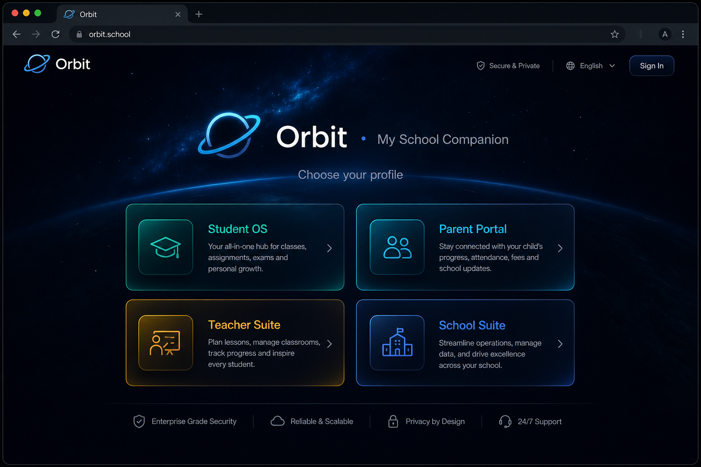
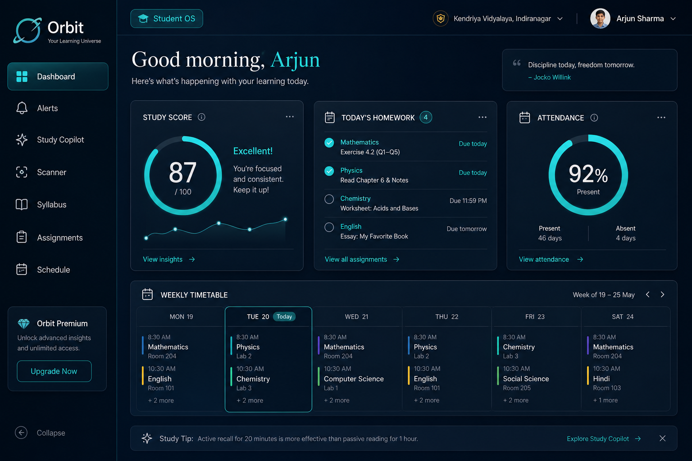
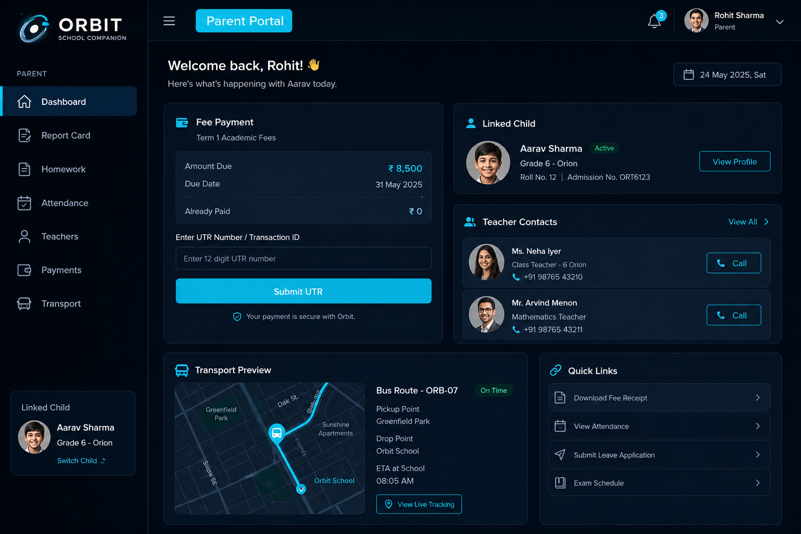
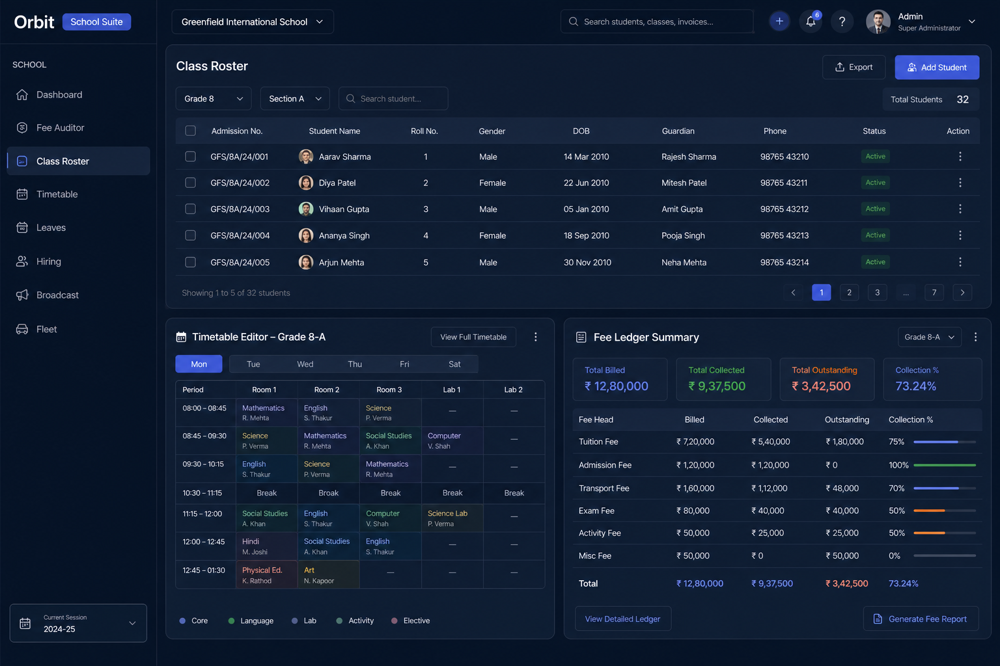

<p align="center">
  
</p>

<h1 align="center">Orbit · My School Companion</h1>

<p align="center">
  <strong>One school app for students, parents, teachers, and school admins.</strong><br />
  Attendance, homework, fees, timetable, syllabus, alerts, and day-to-day school life — in English &amp; Telugu.
</p>

<p align="center">
  
  
  
</p>

---

## What is Orbit?

Orbit is a **K–12 school companion** that brings every persona onto one shared surface:

| Role | What they get |
|------|----------------|
| **Student** | Study copilot, homework, syllabus notes, scanner, schedule, attendance, achievements |
| **Parent** | Child academics, homework follow-up, fees & UTR payments, teachers, bus transport |
| **Teacher** | Class attendance, marks, homework tracking, syllabus, leave requests |
| **School** | Fee ledger, class roster, timetable editor, leaves, broadcasts, fleet overview |

Families and staff stay aligned on the same child, class, and school calendar — instead of juggling WhatsApp groups, paper circulars, and spreadsheets.

---

## How the UI looks

Dark glass panels, role-colored accents, and a sidebar that switches by persona. Designed to feel calm on laptop and phone (installable as a PWA).

### Landing — choose your profile

<p align="center">
  
</p>

### Student OS

<p align="center">
  
</p>

### Parent Portal

<p align="center">
  
</p>

### School Suite

<p align="center">
  
</p>

> Previews illustrate the product direction. Open the live app for the exact interactive UI.

---

## Features

### Shared across roles
- **Alerts** — in-app notification bell; optional push & SMS when configured
- **School calendar** — events the whole community can see
- **Bilingual UI** — English and Telugu
- **Light / dark theme**
- **AI helpers** — study / homework / worksheet scanning with Gemini when configured
- **Sample-filled tabs** — demos stay complete until live school data is connected

### Student
- Dashboard with study score & today’s focus
- **Study Copilot** — ask questions, get guided help
- **Scanner** — photograph worksheets (Math, Science, Physics, Chemistry, English)
- **Syllabus explorer** with topic progress and teacher notes
- Assignments, weekly **schedule / timetable**, attendance, achievements, extracurriculars

### Parent
- Linked-child view of report card, homework, and attendance
- **Teachers directory** with call actions
- **Fee payments** via UTR submission against the class ledger
- **Bus / transport** status
- Extracurricular discovery

### Teacher
- Mark **class attendance** and **marks**
- Assign & track **homework** (who finished)
- Manage **syllabus** topics and attach notes
- Request **leaves**
- Explore sample job matches (demo)

### School admin
- **Fee auditor** — class ledger of student payments
- **Class roster** with attendance snapshot
- **Timetable editor** for class periods
- Leave approvals, hiring pipeline (demo), broadcasts, fleet overview (demo)

---

## Product map

```text
                    ┌─────────────┐
                    │   Orbit     │
                    │  Landing    │
                    └──────┬──────┘
           ┌───────────────┼───────────────┐
           ▼               ▼               ▼
      Student OS     Parent Portal   Teacher Suite
           │               │               │
           └───────────────┼───────────────┘
                           ▼
                     School Suite
                           │
              Shared: Alerts · Calendar · AI · i18n
```

---

## Try a demo profile

| Profile | Email | Password |
|---------|-------|----------|
| Student | `student@orbit.app` | `student123` |
| Parent | `parent@orbit.app` | `parent123` |
| Teacher | `teacher@orbit.app` | `teacher123` |
| School | `admin@orbit.app` | `admin123` |

```bash
npm install
npm run dev
```

Setup for contributors (Supabase, env, deploy) lives in [`docs/DEVELOPERS.md`](docs/DEVELOPERS.md).

---

<p align="center">
  <em>Built for Indian K–12 schools — one companion for the whole orbit of school life.</em>
</p>
